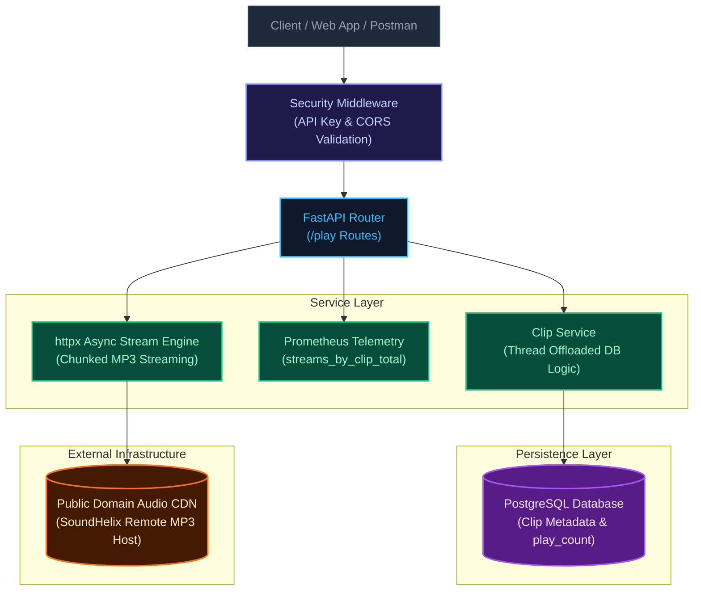

# Soundverse "Play" Service — Audio Preview Streaming API

[](https://www.python.org/)
[](https://fastapi.tiangolo.com/)
[](https://www.postgresql.org/)
[](https://www.sqlalchemy.org/)
[](https://www.docker.com/)
[](https://prometheus.io/)
[](https://soundverse-play-backend.onrender.com)
[](https://github.com/)

A backend service built with FastAPI, PostgreSQL, and SQLAlchemy 2.0 for **"Play"** — a lightweight audio preview library that allows users to browse audio metadata, stream public domain MP3 audio clips asynchronously, track stream metrics, and monitor operational telemetry.

**Live Deployment URL:** https://soundverse-play-backend.onrender.com

---

## 1. System Overview & Problem Statement

The "Play" service provides lightweight preview streaming for audio tracks. The primary engineering goals behind this implementation include:

1. **Non-Blocking Streaming Performance:** Audio streaming over HTTP can tie up worker threads. The streaming endpoint handles distant MP3 streaming asynchronously while using worker thread offloading for database interactions to prevent event-loop starvation.
2. **Atomic Play Count Increments:** Every valid audio stream request automatically updates the database `play_count` counter for that specific clip in PostgreSQL.
3. **API Security:** All core business routes are protected behind lightweight API Key authorization headers (`X-API-Key`) with configurable CORS policies and enforced database SSL in production environments.
4. **Full Telemetry & Observability:** Out-of-the-box support for Prometheus metrics scraping (`starlette_exporter`), including custom counters tracking streams segmented by individual `clip_id`, visualization-ready via local Docker Compose Grafana setups.

---

## 2. Key Engineering Highlights

- **Clean Layered Architecture:** Strict separation of concerns across presentation (`app/api/routes`), business logic (`app/services`), data persistence (`app/models`), domain validation (`app/schemas`), and security (`app/core`).
- **Non-Blocking Async Execution:** Database queries execute via SQLAlchemy 2.0 synchronous sessions. In asynchronous endpoint contexts (like audio streaming), synchronous database calls are offloaded using `anyio.to_thread.run_sync` to maintain a non-blocking asyncio event loop.
- **Resilient Audio Streaming:** Audio bytes are fetched asynchronously from remote storage using `httpx.AsyncClient` with redirect follow policies and piped via FastAPI `StreamingResponse` without loading entire files into memory.
- **Custom Telemetry:** Includes an operational Prometheus `Counter` (`streams_by_clip_total`) tracking stream events labeled by `clip_id` and track title, accessible at `/metrics`.
- **Automated Data Seeding:** Features an idempotent database seeding script (`scripts/seed_db.py`) populated with 6 royalty-free / public domain audio tracks.
- **Production-Ready Exception Formatting:** Centralized global exception handlers standardize standard HTTP errors (`404`), schema validation errors (`422`), and internal server exceptions (`500`) into consistent JSON payloads.

---

## 3. Architecture & Request Pipeline



---

## 4. Repository Structure

```text
soundverse-play-service/
├── .github/
│   └── workflows/
│       └── ci.yml               # GitHub Actions workflow (linting & test execution)
├── app/
│   ├── __init__.py
│   ├── main.py                  # FastAPI app setup, CORS, lifespan, global error handlers
│   ├── api/
│   │   ├── __init__.py
│   │   └── routes/
│   │       ├── __init__.py
│   │       └── play.py          # /play routes (GET catalog, POST clip, GET stream, GET stats)
│   ├── core/
│   │   ├── __init__.py
│   │   ├── config.py            # Pydantic v2 settings management (.env parsing)
│   │   ├── database.py          # SQLAlchemy 2.0 engine, sessions, SSL support
│   │   ├── logging.py           # Structured JSON application logger
│   │   └── security.py          # API Key (X-API-Key) dependency validator
│   ├── models/
│   │   ├── __init__.py
│   │   └── clip.py              # SQLAlchemy ORM model definition
│   ├── monitoring/
│   │   ├── __init__.py
│   │   └── metrics.py           # Prometheus starlette_exporter & custom stream counter
│   ├── schemas/
│   │   ├── __init__.py
│   │   └── clip.py              # Pydantic request/response schemas
│   └── services/
│       ├── __init__.py
│       └── clip_service.py      # Business logic & PostgreSQL queries
├── scripts/
│   └── seed_db.py               # Idempotent database initial seeding script
├── tests/
│   ├── __init__.py
│   ├── conftest.py              # Pytest fixtures, test DB setup & security overrides
│   └── test_play.py             # Integration test suite for endpoints
├── .env.example                 # Template environment variable configuration
├── .gitignore                   # Standard Python git exclusions
├── docker-compose.yml           # Local PostgreSQL + Prometheus + Grafana stack
├── prometheus.yml               # Prometheus scraping config for local development
├── README.md                    # System documentation
├── render.yaml                  # Render continuous deployment blueprint
└── requirements.txt             # Python dependency manifest
```

---

## 5. API Reference & Contract Specification

All API endpoints except `/health` and `/metrics` accept the security header:

```text
X-API-Key: soundverse-secret-key-2026
```

### Summary of Endpoints

| Method | Endpoint | Description | Auth Required |
|---|---|---|---|
| GET | `/health` | Application health check & environment info | No |
| GET | `/play` | Fetch all available audio clips | Yes |
| POST | `/play` | Register a new audio clip entry (Bonus) | Yes |
| GET | `/play/{id}/stream` | Stream audio bytes & increment `play_count` | Yes |
| GET | `/play/{id}/stats` | Fetch metadata and play count for a clip | Yes |
| GET | `/metrics` | Expose Prometheus operational telemetry metrics | No / Custom |

---

### Endpoint Details

#### 1. GET `/health`

**Response 200 OK:**

```json
{
  "status": "ok",
  "environment": "production"
}
```

---

#### 2. GET `/play`

**Headers:**

```text
X-API-Key: soundverse-secret-key-2026
```

**Response 200 OK:**

```json
[
  {
    "id": 1,
    "title": "Acoustic Breeze",
    "description": "Relaxing acoustic guitar melody for background listening",
    "genre": "Acoustic",
    "duration": 157.0,
    "audio_url": "https://www.soundhelix.com/examples/mp3/SoundHelix-Song-1.mp3",
    "play_count": 4
  },
  {
    "id": 2,
    "title": "Electronic Beats",
    "description": "Upbeat energetic electronic synth track",
    "genre": "Electronic",
    "duration": 210.0,
    "audio_url": "https://www.soundhelix.com/examples/mp3/SoundHelix-Song-2.mp3",
    "play_count": 2
  }
]
```

---

#### 3. GET `/play/{id}/stream`

**Headers:**

```text
X-API-Key: soundverse-secret-key-2026
```

**Response 200 OK:**

- **Headers:** `Content-Type: audio/mpeg`
- **Body:** Audio binary byte stream (`audio/mpeg`)
- **Side Effect:** Increments `play_count` by +1 in PostgreSQL and updates Prometheus metric `streams_by_clip_total`.

---

#### 4. GET `/play/{id}/stats`

**Headers:**

```text
X-API-Key: soundverse-secret-key-2026
```

**Response 200 OK:**

```json
{
  "id": 1,
  "title": "Acoustic Breeze",
  "play_count": 5
}
```

**Response 404 Not Found:**

```json
{
  "error": "Clip not found",
  "code": 404
}
```

---

#### 5. POST `/play` (Bonus)

**Headers:**

```text
X-API-Key: soundverse-secret-key-2026
```

**Request Body:**

```json
{
  "title": "Lo-Fi Chill",
  "description": "Relaxing lo-fi beat for focus",
  "genre": "Lo-Fi",
  "duration": 120.5,
  "audio_url": "https://www.soundhelix.com/examples/mp3/SoundHelix-Song-6.mp3"
}
```

**Response 201 Created:**

```json
{
  "id": 7,
  "title": "Lo-Fi Chill",
  "description": "Relaxing lo-fi beat for focus",
  "genre": "Lo-Fi",
  "duration": 120.5,
  "audio_url": "https://www.soundhelix.com/examples/mp3/SoundHelix-Song-6.mp3",
  "play_count": 0
}
```

---

## 6. Local Setup, Execution & Testing

### 1. Environment Initialization

Clone the repository and install dependencies:

```bash
# 1. Clone repository
git clone https://github.com/YOUR_USERNAME/soundverse-play-service.git
cd soundverse-play-service

# 2. Set up Python virtual environment
python3 -m venv .venv
source .venv/bin/activate  # On Windows: .venv\Scripts\activate

# 3. Install required packages
pip install -r requirements.txt

# 4. Copy environment configuration
cp .env.example .env
```

---

### 2. Run Local Infrastructure (PostgreSQL, Prometheus & Grafana)

Start local containers using Docker Compose:

```bash
docker-compose up -d
```

Services:

- **PostgreSQL:** `localhost:5432`
- **Prometheus:** `http://localhost:9090`
- **Grafana:** `http://localhost:3000`
  - Login: `admin / admin`

---

### 3. Seed Database & Start Web Application

Populate PostgreSQL with initial clips and launch the Uvicorn server:

```bash
# Seed initial clips metadata
python -m scripts.seed_db

# Start FastAPI development server
uvicorn app.main:app --reload --port 8000
```

Available endpoints:

- **API Interactive Swagger Docs:** `http://127.0.0.1:8000/docs`
- **API Health Check:** `http://127.0.0.1:8000/health`

---

### 4. Running Automated Tests

Execute unit and integration tests via Pytest:

```bash
pytest
```

---

## 7. Deployment & Observability

### Render Deployment Configuration

The service is deployed on Render using the included `render.yaml` blueprint.

- **Database Engine:** Render PostgreSQL Free Instance (`sslmode=require` enforced in production).
- **Build Command:** `pip install -r requirements.txt`
- **Start Command:** `python -m scripts.seed_db && uvicorn app.main:app --host 0.0.0.0 --port $PORT`

### Environment Variables

```text
DATABASE_URL=<Render PostgreSQL connection string>
ENV=production
API_KEY=soundverse-secret-key-2026
```

### Observability Telemetry (`/metrics`)

Operational metrics are exposed via `starlette_exporter` and custom Prometheus instruments.

Prometheus automatically scrapes:

- HTTP request rates
- Response status code distributions
- Latency histograms
- Stream counts per clip ID (`streams_by_clip_total`)

---

## 8. Author & Submission Contact

- **Author:** Sanket Kisan Chavhan
- **Live Service:** https://soundverse-play-backend.onrender.com
- **GitHub Repository:** https://github.com/sanket9673/Soundverse
- **Email Contact:** sanketch9673@gmail.com